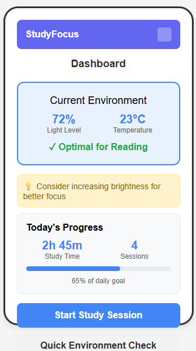
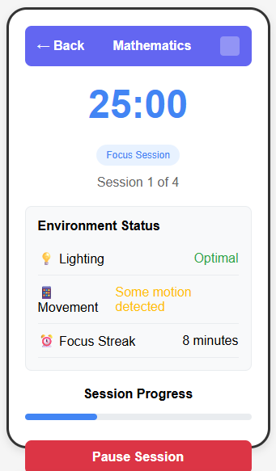
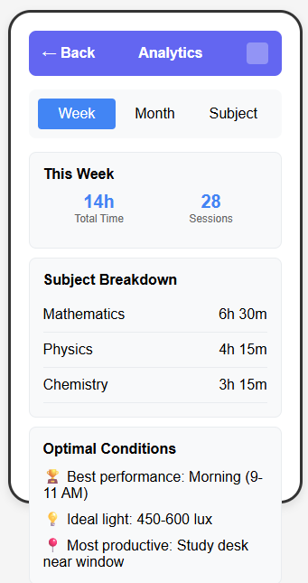
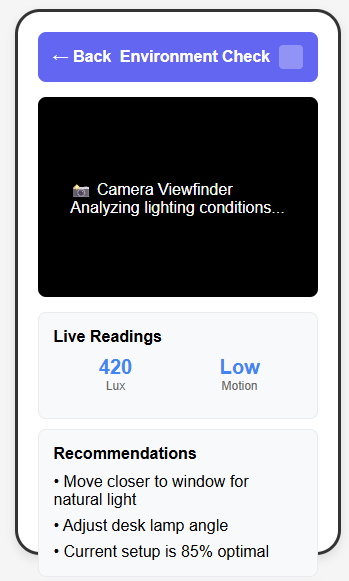
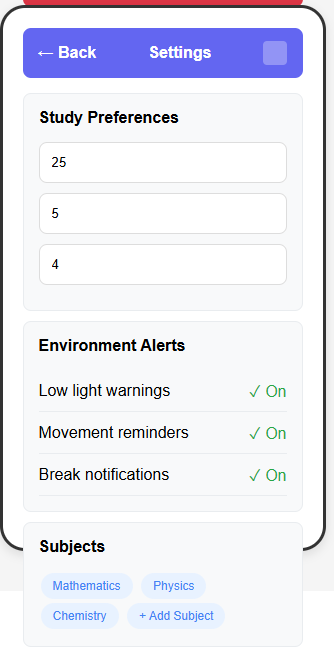
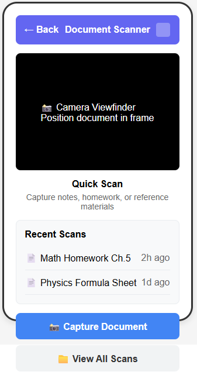

# StudyFocus

A comprehensive study companion app built with React Native and Expo that helps students optimize their study environment, track their progress, and maintain focus through intelligent monitoring and analytics.

## App Description

StudyFocus is designed to be the ultimate study companion for students who want to maximize their learning efficiency. The app combines environmental monitoring, session tracking, and document management into a cohesive platform that adapts to each user's study habits and preferences.

The core functionality revolves around intelligent study session management with real-time environment analysis. Using device sensors, the app monitors lighting conditions and motion levels to provide recommendations for optimal study environments. Students can track their study sessions across different subjects, set daily goals, and view detailed analytics to understand their productivity patterns.

Key features include:

- **Smart Environment Monitoring**: Real-time analysis of lighting and motion conditions with personalized recommendations
- **Study Session Tracking**: Pomodoro-style timer with customizable session and break lengths
- **Subject Management**: Organize study sessions by subject with color-coded tracking
- **Document Scanner**: Built-in camera functionality to scan and organize study materials
- **Analytics Dashboard**: Comprehensive insights into study habits, productivity trends, and goal progress
- **Multi-theme Support**: Light, dark, and focus themes optimized for different study environments

The app is built using modern React Native practices with Expo, ensuring smooth performance across iOS and Android devices while maintaining a native feel and appearance.

## Wireframes

<!-- Add your screenshots here -->

*Main dashboard showing today's progress and environment status*


*Active study session with timer and environment monitoring*


*Detailed analytics and progress tracking*


*Environment monitoring with recommendations*


*Customizable preferences and theme selection*


*Built-in document scanning functionality*

## Material Design Implementation

StudyFocus extensively implements Google's Material Design principles to create an intuitive and visually appealing user experience that feels native across Android and iOS platforms. The app follows Material Design's foundational principles of material metaphor, bold graphic design, and meaningful motion to create a cohesive and professional interface.

The color system is carefully crafted using Material Design's color palette guidelines, with a primary blue (#4285f4) that conveys trust and focus, complemented by semantic colors for different states (success green, warning amber, error red). The app implements proper color contrast ratios ensuring accessibility compliance, and each theme variant (light, dark, focus) maintains these standards while adapting to different lighting conditions. Typography follows Material Design's type scale with Roboto-inspired font weights and sizes, creating clear information hierarchy throughout the interface. Card-based layouts with consistent elevation and shadow systems provide visual depth and help organize content into digestible sections.

Component design strictly adheres to Material Design specifications, including proper touch target sizes (minimum 48dp), consistent spacing using the 8dp grid system, and standardized component behaviors. The app features Material Design's signature floating action buttons, properly styled input fields with focus states, and navigation patterns that follow platform conventions. Interactive elements provide appropriate feedback through ripple effects, state changes, and micro-animations that guide user attention and confirm actions. The bottom navigation and header patterns follow Material Design guidelines while adapting to the specific needs of study session management.

Motion design plays a crucial role in the user experience, with carefully choreographed transitions between screens and states that feel natural and purposeful. Page transitions use Material Design's shared element transitions where appropriate, and loading states provide clear feedback without jarring interruptions. The timer and progress indicators use smooth animations that maintain the user's focus while providing essential feedback about session progress. All animations respect user preferences for reduced motion and maintain the app's core functionality even when animations are disabled, ensuring accessibility for all users.

## Installation & Setup

1. Clone the repository
2. Install dependencies: `npm install`
3. Start the development server: `npx expo start`
4. Scan the QR code with Expo Go app or run on simulator

## Technologies Used

- **React Native** - Cross-platform mobile development
- **Expo** - Development platform and build tools
- **Expo Router** - File-based navigation system
- **AsyncStorage** - Local data persistence
- **Expo Sensors** - Device sensor integration
- **Expo Camera** - Camera functionality for document scanning
- **React Native Chart Kit** - Data visualization
- **Expo Vector Icons** - Icon library (Ionicons)

## Project Structure

```
StudyFocus/
├── app/                    # Main app screens (Expo Router)
├── src/
│   ├── components/         # Reusable UI components
│   ├── context/           # React Context providers
│   ├── services/          # Business logic and API services
│   ├── storage/           # Data persistence utilities
│   ├── styles/            # Theme system and global styles
│   └── utils/             # Helper functions
└── assets/                # Images and static resources
```

## Features

### Core Functionality
- **Study Session Management**: Start, pause, resume, and track study sessions
- **Environment Monitoring**: Real-time analysis of study conditions
- **Subject Organization**: Color-coded subject tracking and management
- **Goal Setting**: Daily and weekly study goal configuration
- **Break Management**: Automated break suggestions and tracking

### Analytics & Insights
- **Progress Tracking**: Daily, weekly, and monthly study statistics
- **Productivity Metrics**: Focus scores and environment quality trends
- **Subject Performance**: Detailed breakdown by study subject
- **Optimal Study Times**: AI-recommended study periods based on historical data

### Additional Features
- **Document Scanner**: Scan and organize study materials
- **Theme Support**: Multiple theme options for different preferences
- **Data Export**: Export study data for external analysis
- **Offline Support**: Full functionality without internet connection

## License

This project is developed for educational purposes as part of a mobile application development course.